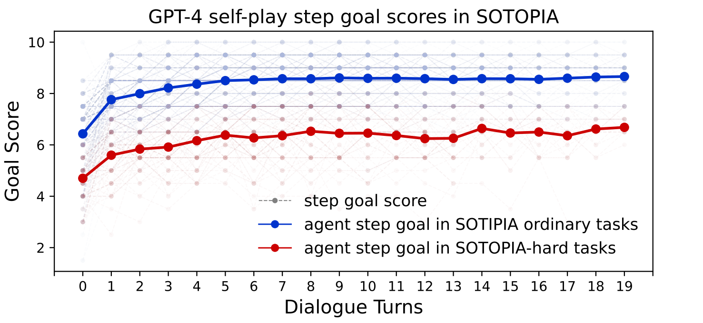
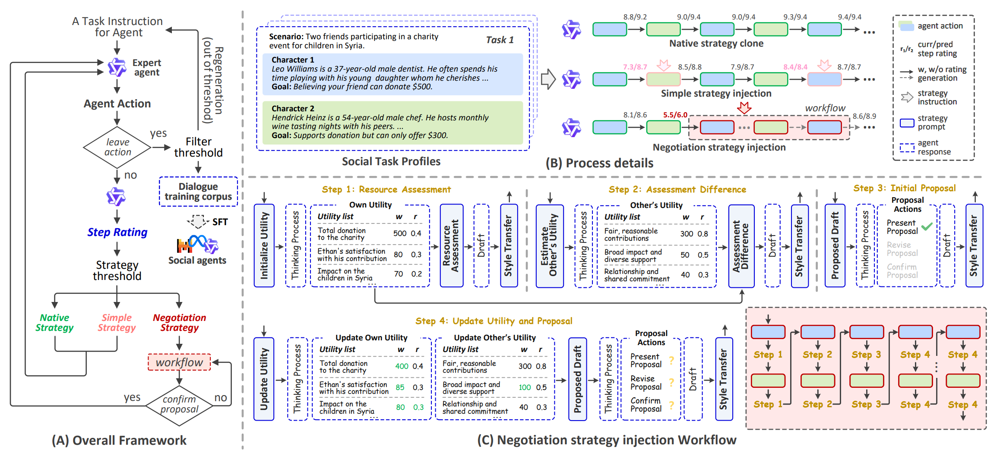
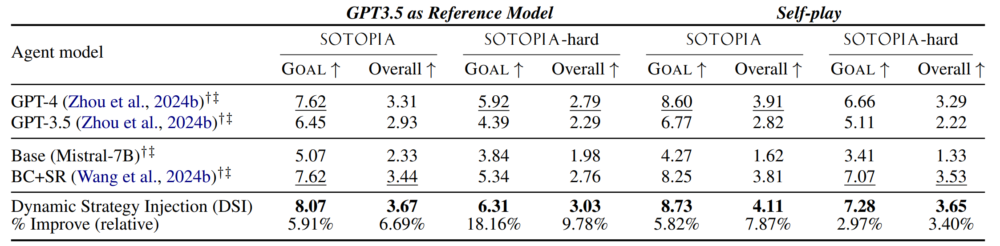

#  SOTOPIA-Ω: Dynamic Strategy Injection Learning and Social Instruction Following Evaluation for Social Agents


## 📢 Release

* [05/29] ✨️ The dynamic generation code for high-quality dialogue training corpus has been open-sourced.
* [05/16] 🎉 The paper has been accepted by the **main conference of ACL 2025**!
* [02/19] 🔥 We released our model checkpoints on huggingface ([mistral-7B-DSI](https://huggingface.co/WENYUAN98/sotopia-omega_mistral-7B-DSI), [llama3-8B-DSI](https://huggingface.co/WENYUAN98/sotopia-omega_llama3_8B_DSI), [qwen2.5-7B-DSI](https://huggingface.co/WENYUAN98/sotopia-omega_qwen2.5-7B-DSI)).
* [02/19] 📊 We released our high high-quality dialogue training corpus on huggingface ([sotopia-omega](https://huggingface.co/datasets/WENYUAN98/sotopia-omega)).

## 🚀 Introduction

<div align="center">
  
</div>

We propose an adaptive fast-slow thinking framework for high-quality dialogue data synthesis: **SOTOPIA-Ω**. This framework addresses the **negotiation deadlock** issue in social conversations.


<div align="center">
  
</div>

Despite the abundance of prior social strategies possessed by humans, there remains a paucity of research dedicated to their transfer and integration into social agents. Our proposed SOTOPIA-Ω framework aims to address and bridge this gap, with a particular focus on enhancing the social capabilities of language agents. This framework dynamically injects a variety of social strategies into expert agents, thereby automating the construction of high-quality social dialogue training corpus. Additionally, we introduce the concept of Social Instruction Following (S-IF) and propose two new S-IF evaluation metrics that are complementary to social capability. We demonstrate that several 7B models trained on high-quality corpus not only significantly surpasses the expert agent (GPT-4) in achieving social goals but also enhances S-IF performance. Analysis and variant experiments validate the advantages of dynamic construction, which can especially break the agent's prolonged deadlock.

<div align="center">
  
</div>

## 📖 Contents

- Install dependencies:
  ```bash
  pip install -r requirements.txt
  ```
- Download [Qwen2.5-72B-Instruct](https://huggingface.co/Qwen/Qwen2.5-72B-Instruct)
- Launch Qwen2.5-72B-Instruct with vLLM
  ```bash
  sh run.sh
  ```
- Dynamic high-quality dialogue training corpus generation
  ```bash
  python dynamic_dialog_generate.py
  ```
- Training the social agents based on [LLaMA-Factory](https://github.com/hiyouga/LLaMA-Factory) framework, with training parameters referenced in file *train_mistral_7b.sh*, *train_llama3_8b.sh*, and *train_qwen2.5_7b.sh*.

  Before training, ensure that the accelerator *Unsloth* is installed (version: https://github.com/unslothai/unsloth/tree/December-2024).

  The generated dataset is registered under the name "sotopia_omega". Modify the local LLM path and set the output checkpoint directory.

- For inference and evaluation, please refer to the official SOTOPIA repository (https://github.com/sotopia-lab/sotopia).


## Citation
If you find our work useful, please consider citing our paper:
```bibtex
@misc{zhang2025sotopiaomegadynamicstrategyinjection,
      title={{SOTOPIA-$\Omega$}: Dynamic Strategy Injection Learning and Social Instruction Following Evaluation for Social Agents}, 
      author={Wenyuan Zhang and Tianyun Liu and Mengxiao Song and Xiaodong Li and Tingwen Liu},
      year={2025},
      eprint={2502.15538},
      archivePrefix={arXiv},
      primaryClass={cs.CL},
      url={https://arxiv.org/abs/2502.15538}, 
}
```
